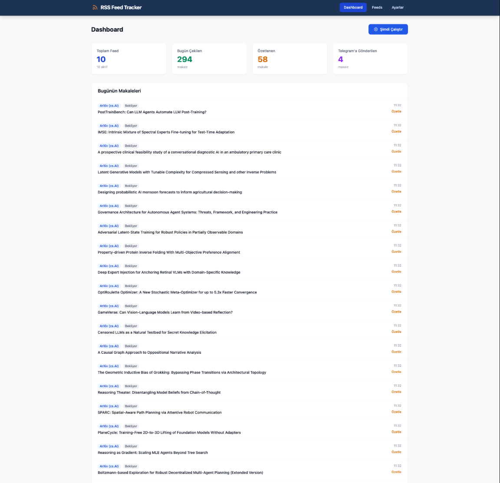
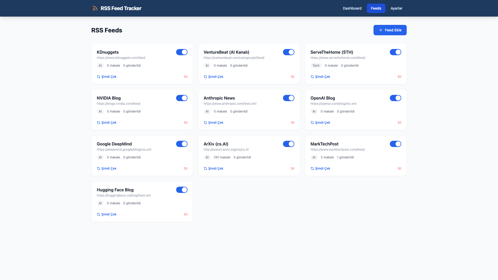
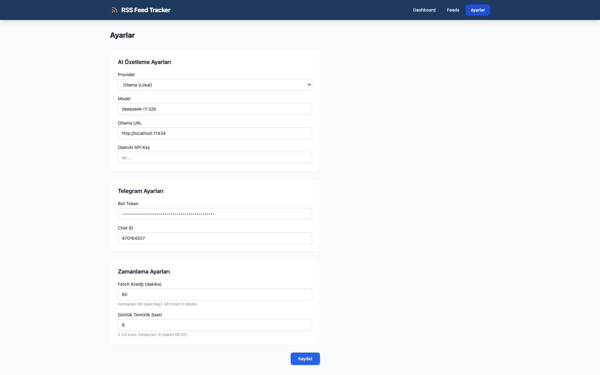

# RSS Feed Tracker

RSS/Atom feedlerden haberleri otomatik olarak çeken, yapay zeka ile Türkçe özetleyen ve Telegram'a gönderen bir sistemdir. FastAPI tabanlı web arayüzü üzerinden feed yönetimi, izleme ve manuel tetikleme yapılabilir.

## Neden Yapıldı?

Günlük olarak takip edilen onlarca AI/teknoloji kaynağını tek tek ziyaret etmek yerine, bu sistem haberleri otomatik toplar, AI ile özetler ve özetleri doğrudan Telegram'a gönderir. Böylece günün önemli gelişmelerini kısa özetler halinde tek bir yerden takip edebilirsiniz.

## Ekran Görüntüleri

### Dashboard


### Feed Yönetimi


### Ayarlar


## Özellikler

- **RSS/Atom feed desteği** — Herhangi bir RSS veya Atom feed URL'si eklenebilir
- **AI özetleme** — Ollama (DeepSeek, Qwen, Llama vb.) veya OpenAI API ile Türkçe özetleme
- **Telegram entegrasyonu** — Özetlenen haberler otomatik olarak Telegram'a gönderilir
- **Otomatik pipeline** — Belirli aralıklarla (varsayılan: 60 dk) fetch → özetle → gönder döngüsü çalışır
- **Günlük temizlik** — Eski günlerin verileri belirlenen saatte otomatik silinir
- **Web dashboard** — Feed yönetimi, günlük istatistikler ve makale listesi
- **Manuel tetikleme** — Dashboard üzerinden "Şimdi Çalıştır" butonu ile anında çalıştırma
- **Web UI üzerinden ayar yönetimi** — AI provider, model, Telegram bilgileri gibi ayarlar arayüzden değiştirilebilir

## Mimari

```
RSS Feeds → Feed Fetcher → SQLite DB → AI Summarizer → Telegram Sender
                                ↑                            ↓
                          Web Dashboard ←──────────── Telegram Chat
```

| Bileşen | Teknoloji |
|---------|-----------|
| Backend | FastAPI, SQLAlchemy (async), APScheduler |
| Veritabanı | SQLite (aiosqlite) |
| AI | Ollama (lokal) veya OpenAI API |
| Bildirim | Telegram Bot API |
| Frontend | Jinja2 Templates |

## Gereksinimler

- **Python 3.10+**
- **Ollama** (lokal AI kullanmak için) veya OpenAI API anahtarı
- **Telegram Bot** (bildirimler için)

## Kurulum

```bash
git clone https://github.com/melihceyhan/RSSFeedTracker.git
cd RSSFeedTracker

python3 -m venv venv
source venv/bin/activate        # Windows: venv\Scripts\activate

pip install -r requirements.txt
```

## Yapılandırma

`.env.example` dosyasını kopyalayıp düzenleyin:

```bash
cp .env.example .env
```

`.env` dosyasındaki ayarlar:

| Değişken | Açıklama | Varsayılan |
|----------|----------|------------|
| `AI_PROVIDER` | AI sağlayıcı: `ollama` veya `openai` | `ollama` |
| `AI_MODEL` | Kullanılacak model adı | `qwen2.5:7b` |
| `OLLAMA_BASE_URL` | Ollama sunucu adresi | `http://localhost:11434` |
| `OPENAI_API_KEY` | OpenAI API anahtarı (openai seçiliyse) | — |
| `TELEGRAM_BOT_TOKEN` | BotFather'dan alınan bot token | — |
| `TELEGRAM_CHAT_ID` | Mesajların gönderileceği chat/grup ID | — |
| `FETCH_INTERVAL_MINUTES` | Feed çekme aralığı (dakika) | `60` |
| `DAILY_CLEANUP_HOUR` | Eski verilerin silineceği saat | `6` |
| `DATABASE_URL` | Veritabanı bağlantı adresi | `sqlite+aiosqlite:///./rss_tracker.db` |

### Telegram Bot Oluşturma

1. Telegram'da [@BotFather](https://t.me/BotFather) ile konuşun
2. `/newbot` komutuyla yeni bir bot oluşturun
3. Aldığınız token'ı `TELEGRAM_BOT_TOKEN` olarak `.env` dosyasına yazın
4. Chat ID'nizi öğrenmek için bota mesaj gönderdikten sonra `https://api.telegram.org/bot<TOKEN>/getUpdates` adresini ziyaret edin
5. `TELEGRAM_CHAT_ID` olarak `.env` dosyasına yazın

### Ollama Kurulumu (Lokal AI)

```bash
# Ollama'yı kurun (https://ollama.ai)
# İstediğiniz modeli çekin:
ollama pull deepseek-r1:32b

# .env dosyasında:
AI_PROVIDER=ollama
AI_MODEL=deepseek-r1:32b
```

## Çalıştırma

```bash
python run.py
```

Uygulama varsayılan olarak `http://localhost:8000` adresinde başlar.

### Web Arayüzü

| Sayfa | Yol | Açıklama |
|-------|-----|----------|
| Dashboard | `/` | Günlük istatistikler, makale listesi, manuel çalıştırma |
| Feedler | `/feeds` | Feed ekleme, düzenleme, silme, aktif/pasif yapma |
| Ayarlar | `/settings` | AI provider, model, Telegram ve zamanlama ayarları |

### API Endpoints

| Metod | Endpoint | Açıklama |
|-------|----------|----------|
| `GET` | `/api/feeds` | Tüm feedleri listele |
| `POST` | `/api/feeds` | Yeni feed ekle |
| `PUT` | `/api/feeds/{id}` | Feed güncelle |
| `DELETE` | `/api/feeds/{id}` | Feed sil |
| `GET` | `/api/articles` | Makaleleri listele |
| `POST` | `/api/pipeline/run` | Pipeline'ı manuel çalıştır |

### Feed Ekleme (API)

```bash
curl -X POST http://localhost:8000/api/feeds \
  -H "Content-Type: application/json" \
  -d '{"name": "OpenAI Blog", "url": "https://openai.com/blog/rss.xml", "category": "AI"}'
```

## Nasıl Çalışır?

1. **Fetch** — Aktif feedlerden yeni makaleler çekilir. Sadece bugüne ait haberler alınır. RSS içeriği yetersizse, makale URL'sine gidilerek tam içerik çekilir.
2. **Summarize** — Henüz özetlenmemiş makaleler AI modeline gönderilir. 2-3 cümlelik Türkçe özet üretilir. Başarısız olursa 3 denemeye kadar tekrarlanır.
3. **Send** — Özetlenmiş ama henüz gönderilmemiş makaleler Telegram'a MarkdownV2 formatında gönderilir.
4. **Cleanup** — Her gün belirlenen saatte, önceki günlere ait tüm makaleler veritabanından silinir.

Bu döngü ayarlanan aralıkta (varsayılan: 60 dk) otomatik tekrarlanır. Ayrıca dashboard'dan manuel olarak da tetiklenebilir.
